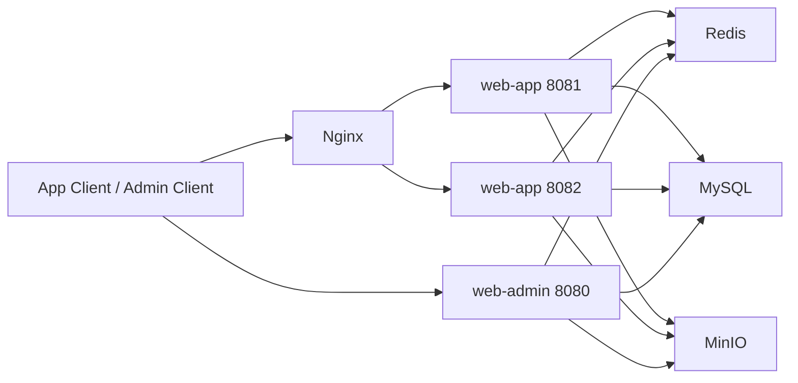

# 智训健身平台


这是一个以前后端联动为目标、以后端治理能力为核心的智训健身平台。后端基于 `Spring Boot 3 + MySQL + Redis + Caffeine + Nginx + MinIO`，采用“`web-admin` 单实例 + `web-app` 可双实例”的工程型单体架构；前端基于 `Vue 3 + Vite + Pinia + Vue Router + Axios + Element Plus`，并补充了 `uni-app` 用户端 H5 / 移动端页面，提供管理端、Web 用户端与移动端三套界面。项目围绕训练计划、课程报名、教练预约、支付回调、退款审计、RBAC 权限与运维回归展开，重点解决多实例部署下的缓存一致性、重复提交、回调幂等、限流与可观测性问题。

## 项目定位

- 工程型单体项目
- 中小规模高并发治理场景
- 以 `MySQL + Redis + Nginx` 为核心的一致性与性能优化项目

## 核心业务闭环

- 训练计划：计划列表、计划详情、订阅、计划项绑定视频资源、AI 生成训练计划
- 训练记录：打卡、历史记录、周统计
- 课程学习：课程管理、排期、报名、支付、退款、我的报名记录
- 教练预约：档期查询、预约创建、支付、完成、评价
- 运营位：Banner、公告、系统配置
- 管理后台：RBAC 权限、操作日志、支付回调审计、退款审计、任务运行记录

## 技术栈

- 后端框架：`Spring Boot 3`、`Spring MVC`、`Spring AOP`
- 数据访问：`MyBatis-Plus`、`MySQL`
- 缓存与并发控制：`Redis`、`Caffeine`
- 认证鉴权：`JWT`、`TokenVersion-enhanced stateless auth`
- AI 集成：`LangChain4j`、`DeepSeek API`
- 前端框架：`Vue 3`、`Vite`
- 前端状态与路由：`Pinia`、`Vue Router`
- 前端请求与组件：`Axios`、`Element Plus`
- 移动端 / H5：`uni-app`
- 对象存储：`MinIO`
- 网关与部署：`Nginx upstream`、`Docker Compose`
- 接口文档：`Knife4j / OpenAPI 3`
- 自动化验证：`Postman/Newman`、`GitHub Actions`

## 当前技术亮点

- `Nginx upstream + dual-instance deployment`：Nginx upstream 负载均衡 + App 双实例部署
- `TokenVersion-enhanced stateless JWT authentication`：基于 TokenVersion 的无状态 JWT 鉴权增强方案
- `Admin RBAC Redis auth cache + targeted eviction`：管理端 RBAC 权限缓存 + 定向失效
- `App auth Redis L2 cache`：用户端登录鉴权 Redis 二级缓存
- `three-layer concurrency control`：三层并发控制
- `fixed-window rate limiting`：固定窗口限流
- `short-lived idempotency key`：短生命周期幂等键
- `fail-open / fail-close graceful degradation`：Fail-Open / Fail-Close 双策略优雅降级
- `callback idempotency`：支付回调幂等控制
- `SET NX EX + Lua compare-and-delete lightweight redis lock`：轻量 Redis 锁增强版，加锁原子化、释放锁安全删除、显式降级语义
- `Caffeine + Redis + Redis Pub/Sub`：Caffeine + Redis + Redis 发布订阅多级缓存
- `Cache-Aside + TTL jitter + null-object caching + hotspot rebuild protection`：旁路缓存 + TTL 抖动 + 空对象缓存 + 热点重建保护
- `@DistributedTaskLock + dynamic task lock TTL`：分布式任务锁 + 动态锁过期时间
- `LangChain4j + DeepSeek structured generation`：基于 LangChain4j 接入 DeepSeek，实现训练计划结构化生成与业务落库
- `uni-app mobile pages`：用户端订单详情、教练申请、账户安全等页面补齐
- `graceful degradation`：优雅降级
- `runtime observability`：运行期可观测性
- `end-to-end regression pipeline`：端到端回归验证流水线

## 系统架构



如果当前 Markdown 渲染器不支持 Mermaid，可参考下面的文字版拓扑：

- App / Admin Client
- App 请求先进入 `Nginx`
- `Nginx` 轮询转发到 `web-app:8081`
- `Nginx` 轮询转发到 `web-app:8082`
- Admin 请求直接进入 `web-admin:8080`
- `web-app:8081`、`web-app:8082`、`web-admin:8080` 共同访问：
- `Redis`
- `MySQL`
- `MinIO`

### 部署形态

- `web-admin`：单实例，默认端口 `8080`
- `web-app`：支持双实例，默认端口 `8081` / `8082`
- `Nginx`：通过 `upstream` 轮询转发到两个 `web-app` 实例
- 认证方式：JWT 无状态认证，不依赖会话粘滞

### 项目模块

- `common`：通用常量、统一响应、JWT、AOP、缓存与守卫组件
- `model`：实体模型与基础审计字段
- `web/web-admin`：后台管理端接口、任务中心、权限与审计
- `web/web-app`：用户端接口、训练/课程/预约/支付业务
- `frontend`：管理端前端工程
- `frontend-app`：用户端 Web 前端工程
- `frontend-uniapp`：用户端 H5 / 移动端前端工程
- `tests`：Postman 集合、并发脚本、双实例验证脚本
- `deploy` / `docker`：Nginx、Compose、环境变量样例

## 当前核心架构设计

### 1. 双实例部署与无状态认证

- `web-app` 已按双实例部署形态设计，Nginx 轮询分发到多个实例
- 使用 `JWT + platform + type + tokenVersion` 进行无状态鉴权
- 通过 `user.status + token_version` 实现账号禁用、密码重置后的即时失效
- 响应头回传 `X-App-Instance`，便于验证负载均衡命中

### 2. 三层并发治理

- 应用层：`@RateLimit`、`@IdempotentSubmit` 做入口限流与短幂等
- Redis 层：短锁、短幂等键、固定窗口限流、验证码/冷却/失败计数
- 数据库层：事务、条件更新、唯一索引兜底最终正确性

对应的高冲突场景：

- 课程报名：短幂等 + 限流 + `booked_count < capacity` + 唯一索引兜底
- 教练预约：短幂等 + 限流 + 原子更新 + 唯一索引兜底
- 支付回调：Redis 短锁 + 状态校验 + 回调审计 + 数据库幂等兜底

### 3. 多级缓存与近实时失效

- 只对静态低频数据使用本地缓存：
- Banner
- Notice
- SystemConfig
- Course List
- Plan List
- Plan Detail Static
- 采用 `Caffeine + Redis + Redis Pub/Sub` 实现多级缓存与近实时失效
- 失效策略固定为：
- 事务提交后删除 Redis 共享缓存
- 删除当前实例本地 Caffeine
- 发布 `cache:evict` 失效消息
- 其他实例订阅后仅删除自己的本地缓存
- 保留 `TTL jitter`、空值缓存、热点互斥重建作为兜底

明确不进入本地缓存的数据：

- 订单详情
- 支付状态
- 退款状态
- 课程排期余量
- 预约状态

### 4. 任务补偿与运维能力

- 内置任务中心，支持任务运行记录、汇总查询、手动触发
- 当前已接入：
- `PAYMENT_COMPENSATE`
- `BOOKING_TIMEOUT_CLOSE`
- 任务执行写入 `task_run_log`
- 双实例下通过 Redis 任务锁避免重复执行

### 5. AI 训练计划生成

- 基于 `LangChain4j + DeepSeek API` 接入大模型能力
- 支持根据用户输入生成训练计划
- 生成结果采用结构化输出约束，并经过字段校验、动作名规范化与计划项映射后落库
- 将大模型调用能力收敛到真实业务链路，而不是停留在独立 Demo 层

### 6. 可观测性与审计

- 统一 `traceId + userId + instanceId` 链路日志
- 关键写操作记录 `operation_log`
- 支付回调、退款、任务补偿都有独立审计记录
- App/Admin 的接口文档统一接入 Knife4j，支持 Bearer 鉴权调试

## 已完成验证

- Maven 编译与测试通过
- Newman 全量回归通过：`127 requests / 389 assertions / 0 failed`
- Nginx 双实例轮询验证通过
- JWT 跨实例访问验证通过
- 课程报名并发验证通过
- 教练预约并发验证通过
- 支付回调重复投递幂等验证通过
- `Caffeine + Redis + Redis Pub/Sub` 近实时失效验证通过
- App/Admin 鉴权缓存与失效验证通过
- 双实例补偿任务互斥实机验收通过
- AI 训练计划生成链路已接入业务服务并具备测试覆盖

## 当前增量更新（v3.0.0）

- 轻量 Redis 锁增强：加锁继续使用 `SET NX EX`，释放锁统一改为 Lua compare-and-delete，锁结果改为显式 `ACQUIRED / BUSY / DEGRADED`
- 缓存击穿保护增强：计划详情缓存改为有上界的随机退避重读，支付回调收敛为“Redis 削峰 + 数据库条件更新幂等兜底”
- H5 / 移动端页面补充：新增并完善订单详情、教练申请、账户安全等用户端页面
- UniApp H5 兼容性修复：收口 `showTabBar / hideTabBar` 调用，避免非 tabBar 页面控制台报错

## 快速开始

### 1. 启动依赖与服务

```powershell
powershell -ExecutionPolicy Bypass -File start-all.ps1
```

### 2. 重置测试数据

```powershell
powershell -ExecutionPolicy Bypass -File tests/reset-test-data.ps1
```

### 3. 常用本地地址

- 管理端 后端：`http://localhost:8080`
- 用户端 后端实例一：`http://localhost:8081`
- 用户端 后端实例二：`http://localhost:8082`
- 管理端 前端：`http://localhost:5173`
- 用户端 前端：`http://localhost:5174`
- Nginx：`http://localhost`

### 4. 双实例验证

```powershell
powershell -ExecutionPolicy Bypass -File tests/check-dual-app-routing.ps1
```

### 5. 并发验证

```powershell
powershell -ExecutionPolicy Bypass -File tests/invoke-concurrent-requests.ps1
```

## 文档导航

- 项目总览与亮点：[doc/工程技术亮点汇总.md](./doc/工程技术亮点汇总.md)
- 双实例与 Redis 并发治理：[doc/单体双实例与Redis并发落地说明.md](./doc/单体双实例与Redis并发落地说明.md)
- 轻量 Redis 锁设计说明：[doc/redis-lock-design.md](./doc/redis-lock-design.md)
- 简历项目亮点：[doc/简历项目亮点（真实增强版）.md](./doc/简历项目亮点（真实增强版）.md)
- 并发方案对比：[doc/并发方案样板场景对比.md](./doc/并发方案样板场景对比.md)
- 中间件与版本清单：[doc/中间件与版本清单.md](./doc/中间件与版本清单.md)
- 部署与环境配置：[doc/部署与环境配置.md](./doc/部署与环境配置.md)
- API 接口清单：[doc/API接口清单与示例.md](./doc/API接口清单与示例.md)
- 请求参数目录：[doc/请求参数目录.md](./doc/请求参数目录.md)
- 权限模型说明：[doc/权限模型说明.md](./doc/权限模型说明.md)
- 服务分层约定：[doc/服务分层约定.md](./doc/服务分层约定.md)
- 常见追问回答：[doc/常见追问回答清单.md](./doc/常见追问回答清单.md)
- 开发参考文档：[doc/开发参考文档.md](./doc/开发参考文档.md)

## 仓库说明

- 当前仓库以稳定演示、并发治理和自动化回归为主，不追求微服务拆分
- 动态交易数据不会进入本地缓存，强一致性仍由数据库事务、条件更新和唯一索引保证
- 如需继续扩展，建议围绕压测、可观测性和演示资产增强，而不是盲目堆叠中间件
