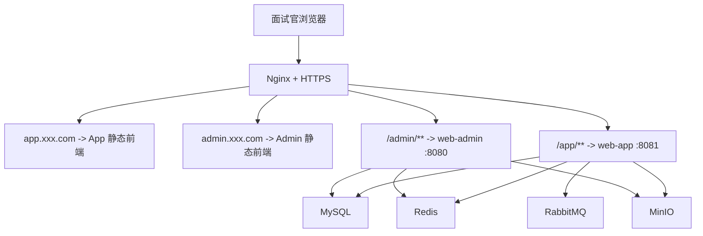

# 个人服务器上线与面试演示规划

## 1. 目标定位

这次上线的目标不是“正式商业发布”，而是：

- 把当前项目部署到我自己的个人服务器上
- 能通过公网域名稳定访问
- 面试时可以直接打开给面试官看
- 能演示 Admin 与 App 两端的核心业务闭环
- 尽量复用当前项目已有结构，不做大规模重构

这次上线更准确的定位是：

- 面试演示版
- 作品集可访问版
- 小范围试用版

不把它定义成：

- 高并发生产版
- 商业支付正式版
- 完整运维治理版

## 2. 当前项目状态判断

基于当前仓库现状，这个项目已经具备“可部署演示”的基础：

- 后端已有 `dev / test / prod` 配置分层
- Admin 与 App 后端接口已经能独立运行
- MySQL、Redis、MinIO、RabbitMQ 已有现成中间件依赖
- Nginx 代理配置已有基础版本，见 `D:\DevelopmentLOOK\Idea\idea_project_workspace\huang-parent\deploy\nginx\fitness.conf`
- Admin 前端与 App 前端都可以单独 `build`
- API 自动化回归与浏览器联调都已经做过

但离“公网可稳定访问”还差一层部署收口，主要差在：

- 前端静态资源正式托管方案还没落地
- Windows 本地启动方式还没切成服务器可维护方式
- 域名、HTTPS、Nginx 站点拆分还没收口
- 公网暴露边界还没整理

## 3. 最推荐的上线方案

### 3.1 方案结论

最推荐的是：

- 单台 Linux 个人服务器
- 中间件用 Docker 容器运行
- 两个 Spring Boot 后端用 `jar + systemd` 运行
- 两个 Vue 前端先 `build` 成静态文件，再由 Nginx 托管
- Admin 与 App 使用两个二级域名分开访问

推荐访问方式：

- App：`https://app.xxx.com`
- Admin：`https://admin.xxx.com`

推荐这样拆，而不是放在同一个域名的不同子路径下，原因很实际：

- 当前两个前端都使用 `createWebHistory()`，并且默认基路径都是 `/`
- 如果强行放成 `https://xxx.com/app-ui/` 和 `https://xxx.com/admin-ui/`，会多出一轮前端基路径改造
- 面试演示场景下，优先选择稳定、简单、低改动方案

### 3.2 推荐拓扑



## 4. 服务器建议配置

面试演示版不需要太高规格，推荐：

- 系统：Ubuntu 22.04 LTS
- CPU：2 核
- 内存：4 GB
- 磁盘：40 GB 以上
- 带宽：3M 以上即可，越高越好

如果你的视频素材会继续放在 MinIO 且直接在线播放，建议：

- 磁盘至少 60 GB
- 优先使用 SSD

## 5. 域名与访问规划

推荐至少准备 2 个子域名：

- `app.xxx.com`
- `admin.xxx.com`

如果你还有备用空间，可以再留：

- `api.xxx.com`：后续统一 API 网关时再用
- `static.xxx.com`：后续静态资源剥离时再用

这次面试版不建议公网开放这些入口：

- MinIO Console
- RabbitMQ 管理台
- Knife4j / OpenAPI 文档
- 数据库端口
- Redis 端口

这些入口建议只保留服务器内网访问，或者临时 SSH 隧道访问。

## 6. 推荐部署方式

## 6.1 中间件层

中间件继续沿用当前项目已使用的组合：

- MySQL
- Redis
- MinIO
- RabbitMQ
- Nginx

推荐方式：

- 用 Docker 容器跑这 5 个组件
- 只把 Nginx 的 `80/443` 暴露公网
- 其余端口尽量不直接暴露

原因：

- 和你当前本地环境最接近
- 容器化中间件最省心
- 迁移成本低
- 面试前故障排查更容易

## 6.2 后端层

后端建议不要在服务器上继续用 `mvn spring-boot:run` 长驻运行，而是改成：

- 本地或服务器打包 `jar`
- 用 `systemd` 托管两个 Java 进程

建议服务名：

- `fitness-admin.service`
- `fitness-app.service`

原因：

- 比手工命令稳定
- 开机自启简单
- 日志查看方便
- 进程挂了可自动拉起

建议端口保持不变：

- `8080`：Admin 后端
- `8081`：App 后端

## 6.3 前端层

前端建议正式化成静态文件部署：

- `frontend` 执行 `npm run build`
- `frontend-app` 执行 `npm run build`
- 构建产物交给 Nginx 托管

推荐目录：

```text
/opt/fitness-platform/
  backend/
    web-admin.jar
    web-app.jar
  frontend/
    admin-dist/
    app-dist/
  env/
    admin.env
    app.env
  logs/
```

Nginx 站点建议拆成两个 server：

- `app.xxx.com` -> `frontend-app/dist`
- `admin.xxx.com` -> `frontend/dist`

同时代理 API：

- `/app/` -> `127.0.0.1:8081`
- `/admin/` -> `127.0.0.1:8080`

## 7. 这次上线前必须补的内容

这次是“演示可访问版”，所以上线前只做最值钱的收口，不无限扩展。

### 7.1 必做项

1. 把前端改成正式构建部署方式
2. 把后端改成 `prod` 环境启动
3. 准备服务器环境变量
4. 配置域名与 HTTPS
5. 跑一轮上线前烟测
6. 整理演示账号和演示数据

### 7.2 强烈建议做

1. 去掉用户端明显的开发/调试痕迹
2. 隐藏不该给用户看的内部字段
3. 确保 MinIO 视频和头像都是真实可访问文件
4. 关闭不必要的公网端口
5. 给数据库和 MinIO 做最小备份

### 7.3 这轮不做

1. 不接真实短信验证码
2. 不接真实第三方支付
3. 不做 Kubernetes
4. 不做复杂 CI/CD 自动发布
5. 不做完整监控告警平台
6. 不做高并发压测治理

## 8. 面试版上线配置建议

这次建议用“最稳妥的演示配置”，不要一上来追求正式商业化复杂度。

### 8.1 后端 profile

- `SPRING_PROFILES_ACTIVE=prod`

### 8.2 支付配置

考虑到这是面试演示版，建议继续保持：

```yml
payment:
  sign:
    mode: mock
```

原因：

- 你现在要证明的是业务闭环和工程能力
- 不是真正收单
- 面试现场最怕第三方支付依赖导致不可控失败

### 8.3 环境变量

当前项目至少要准备这些生产变量：

- `DB_URL`
- `DB_USERNAME`
- `DB_PASSWORD`
- `REDIS_HOST`
- `REDIS_PORT`
- `REDIS_PASSWORD`
- `REDIS_DATABASE`
- `MINIO_ENDPOINT`
- `MINIO_ACCESS_KEY`
- `MINIO_SECRET_KEY`
- `MINIO_BUCKET`
- `ADMIN_PORT`
- `APP_PORT`

建议补充：

- `SPRING_PROFILES_ACTIVE=prod`
- `JAVA_OPTS`

## 9. 推荐执行顺序

为了不无限施工，建议严格按下面顺序推进。

### 第一阶段：部署准备

目标：把服务器基础环境准备好。

工作项：

- 购买并初始化 Linux 服务器
- 配置安全组
- 安装 Docker、JDK 17、Node、Nginx
- 绑定域名解析

完成标准：

- 服务器可 SSH 登录
- Docker 正常
- 域名已解析到服务器

### 第二阶段：中间件落地

目标：让 MySQL、Redis、MinIO、RabbitMQ 在服务器上稳定起来。

工作项：

- 编排并启动容器
- 初始化数据库
- 初始化 MinIO bucket
- 校验中间件内网连通

完成标准：

- 后端能连通数据库、Redis、MinIO
- 旧测试数据可导入

### 第三阶段：后端上线

目标：让两个后端以稳定方式跑起来。

工作项：

- 打包 `web-admin` 和 `web-app`
- 配置 `prod` 环境变量
- 写 `systemd` 服务文件
- 验证 `8080`、`8081` 本机可访问

完成标准：

- 登录接口可用
- 核心 API 可用

### 第四阶段：前端上线

目标：让面试官可以直接通过浏览器访问。

工作项：

- 构建两个前端
- 配置 Nginx 托管静态文件
- 配置 API 反向代理
- 配置 `try_files` 支持 Vue History 路由
- 配 HTTPS

完成标准：

- `https://app.xxx.com` 可打开
- `https://admin.xxx.com` 可打开
- 登录后能正常调用后端

### 第五阶段：面试验收

目标：把演示链路固定下来。

工作项：

- 跑一轮 API 回归
- 跑一轮浏览器烟测
- 固定演示账号
- 固定演示数据
- 整理兜底话术与备用截图

完成标准：

- 演示链路 10 分钟内可稳定复现
- 关键页面无阻断问题

## 10. 上线验收标准

满足下面这些，就算这轮达标，可以停：

1. 公网可以访问 App 和 Admin
2. HTTPS 正常
3. 登录可用
4. 视频播放可用
5. 头像上传可用
6. 训练打卡刷新可同步
7. 课程报名与订单查看可用
8. 教练预约、支付模拟、完成、评价可跑通
9. Admin 可登录并查看视频、订单、日志
10. 演示账号与演示数据固定

## 11. 主要风险与规避策略

### 11.1 风险：面试现场接口失效

规避：

- 面试前一天跑一轮完整烟测
- 准备一个备用账号
- 准备最短演示路径

### 11.2 风险：视频或头像文件失效

规避：

- 所有演示素材都放到 MinIO
- 面试前逐个点开关键视频
- 避免再引用假路径或本地文件路径

### 11.3 风险：前端路由刷新 404

规避：

- Nginx 必须配置 `try_files`
- App 和 Admin 分开域名托管

### 11.4 风险：公网暴露过多

规避：

- 只开放 `80/443`
- 不公开 MySQL、Redis、MinIO Console、RabbitMQ Console

## 12. 我对这次上线的建议边界

为了让这件事能真的完成，而不是无限做下去，我建议边界明确成这样：

- 目标是“个人服务器可访问的面试演示版”
- 不追求正式商业生产级能力
- 不新增大业务
- 只修影响公网演示的阻断问题
- 不做复杂重构
- 不做第三方支付正式接入

达到上面标准后，就应当先停，进入“稳定演示 + 面试使用”阶段。

## 13. 建议工期

如果只做这一轮“个人服务器面试版上线”，比较合理的节奏是：

- 第 1 天：服务器、中间件、数据库、MinIO 准备好
- 第 2 天：后端部署、前端部署、Nginx、HTTPS 跑通
- 第 3 天：完整烟测、修上线阻断、整理演示路径

也就是：

- 最快：2 天
- 稳妥：3 天到 5 天

## 14. 下一步最推荐做什么

如果按照这个规划继续推进，下一步最推荐只做一件事：

1. 先补一份“服务器部署执行清单”，把每一步命令、目录、Nginx 配置、systemd 配置写成可以照着执行的文档。

这一步做完，我们就可以真正开始服务器落地，而不是继续停留在讨论层。
